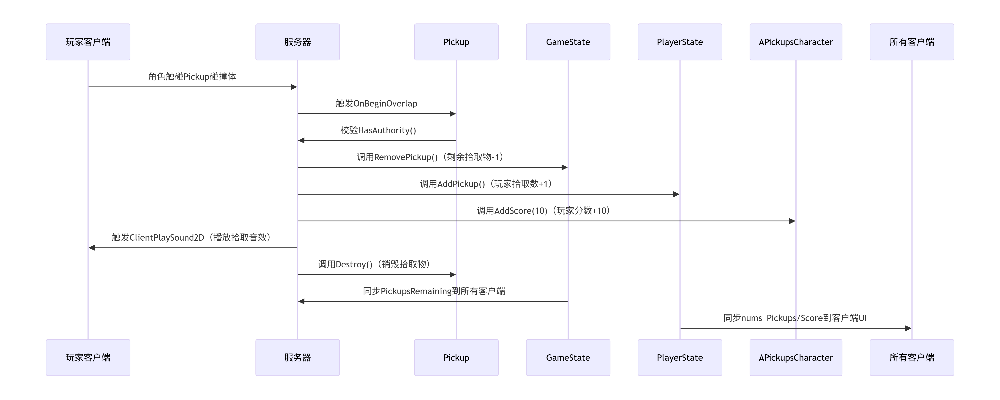
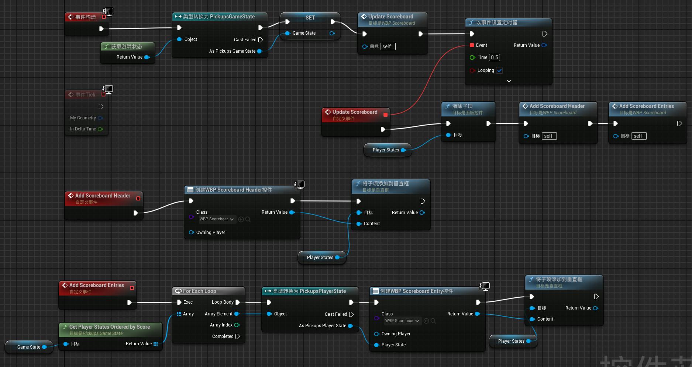

# 项目概述
一个多人拾取金币的小游戏demo，玩家在三维场景中控制角色移动、跳跃，收集物品。每收集一个物品，玩家个人分数增加10，同时全局剩余物品数量减少。当所有物品被收集完毕后，游戏结束，并在5秒后重新开始当前地图。
  
该项目旨在学习对UE5 GamePlay框架的理解，包括游戏模式（GameMode）、游戏状态（GameState）、玩家状态（PlayerState）、玩家控制器（PlayerController）、角色（PlayerCharacter）、网络复制（Replication）、UI（UMG）等。


# 整体架构
PickupsGameMode：从GameState读游戏状态，控制游戏规则，比赛的生命周期。  
PickupsGameState ：存储全局游戏状态（剩余拾取物数量，所有玩家状态），提供访问接口。  
PickupsPlayerState：存储每个玩家信息。  
PickupsPlayerController：每个客户端独立，UI显示。  
PickupsCharacter：处理玩家角色触发的事件（移动、重生、RPC播放音效等）。
Pickup：可拾取物品，碰撞检测，旋转动画。

# 游戏流程
1. 服务器启动  
服务器加载地图，初始化PickupsGameMode，生成拾取物。PickupsGameState::BeginPlay执行：扫描地图中所有APickup实例，初始化PickupsRemaining（剩余拾取物数）；  
2. 玩家连接  
玩家客户端连接服务器，生成PlayerController、PlayerState、Character。  
3. 开始游戏  
PickupsGameMode::HandleMatchHasStarted触发，服务器广播游戏开始，客户端显示调试提示。
当角色与拾取物重叠 OnBeginOverlap() 触发服务器拾取逻辑。  
4. 游戏结束  
GameMode持续检查GameState中PickupsRemaining是否为0。当为0时，调用HandleMatchHasEnded。
销毁所有角色并且通过ServerTravel重新加载当前地图，开始新的一局。


# 具体设计
### Pickup类
Pickup可拾取物品类为Actor的派生类，封装了视觉表现，碰撞触发拾取逻辑，音效播放，分数同步等功能。  

**核心变量：**  
| 变量名 | 类型 | 作用 |
| --- | --- | --- |
| Mesh | UStaticMeshComponent* | 拾取物的视觉表现载体，碰撞检测设置为OverlapALL(仅重叠，物体无阻挡体积) |
| RotatingMovement | 3URotatingMovementComponent* | 实现旋转效果，无序Tick驱动 |
| PickupSound | USoundBase* | 拾取是播放音效，通过客户端RPC调用 |

**核心成员函数：**

构造函数 APickup()
```
APickup::APickup()
{
    // 1. 创建视觉&碰撞核心组件
    Mesh = CreateDefaultSubobject<UStaticMeshComponent>("Mesh");
    Mesh->SetCollisionProfileName("OverlapAll"); // 仅触发重叠，无物理阻挡
    RootComponent = Mesh; // 设为根组件

    // 2. 创建旋转组件，设置旋转速率
    RotatingMovement = CreateDefaultSubobject<URotatingMovementComponent>("Rotating Movement");
    RotatingMovement->RotationRate = FRotator(0.0, 90.0f, 0);

    // 3. 启用网络复制（多人游戏同步）
    bReplicates = true;

    // 4. 禁用默认 Tick，优化性能
    PrimaryActorTick.bCanEverTick = false;
}
```

重叠事件处理OnBeginOverlap()
```
//拾取逻辑的核心处理函数，仅在服务器端执行，实现分数更新、游戏状态同步、音效播放、Actor 销毁等逻辑。 在BeginPlay()中绑定重叠事件到该函数。
void APickup::OnBeginOverlap(UPrimitiveComponent* OverlappedComp, AActor* OtherActor, UPrimitiveComponent* OtherComp, int32 OtherBodyIndex, bool bFromSweep, const FHitResult& Hit)
{
    // 1. 校验: HasAuthority() 保证仅在服务器处理碰撞事件
    APickupsCharacter* Character = Cast<APickupsCharacter>(OtherActor);
    if (Character == nullptr || !HasAuthority()) return;

    // 2. 更新游戏状态
    APickupsGameState* GameState = Cast<APickupsGameState>(GetWorld()->GetGameState());
    if (GameState != nullptr) GameState->RemovePickup();

    // 3. 通过碰撞的Character更新玩家状态
    Character->AddScore(10); // 加 10 分
    Character->AddPickup();  // 增加拾取物计数

    // 4. 客户端RPC播放音效
    Character->ClientPlaySound2D(PickupSound); // 服务器调用，客户端执行

    // 5. 销毁拾取物（服务器触发，同步到所有客户端）
    Destroy();
}
```

### PickupsCharacter
继承自Character类，负责角色行为逻辑，包括基于 Enhanced Input 的移动、跳跃、视角控制表现；角色掉出世界逻辑；角色落地/销毁时音效；与PlayerState交互。 

**核心成员函数：**   
FellOutOfWorld由UE物理系统管理，服务器权威。 重写角色调出世界逻辑。
```
void APickupsCharacter::FellOutOfWorld(const UDamageType& DmgType)
{    //DmgType 伤害类型。 角色调出世界自动调用这个函数
	 /**
	 * 临时保存控制器的引用
	 * 注意：我们需要在 Destroy() 之前保存 Controller 指针，
	 * 因为 Destroy() 会销毁角色，同时可能会清除 Controller 的 Possess 关系，
	 * 导致 Controller 指针变为 nullptr。但我们需要 Controller 来重生玩家。
	 */
	AController* TempController = Controller;

	AddScore(-10);
	Destroy();

    // 获取通过权威GameMode，重新创建角色给Controller。
	AGameMode* GameMode = GetWorld()->GetAuthGameMode<AGameMode>();
	if (GameMode != nullptr)
	{
		GameMode->RestartPlayer(TempController); //重新创建一个Char给Controller
	}
}
```
```
//加分 UE的PlayerState自己带Score相关的内容
void APickupsCharacter::AddScore(const float Score) const
{
	APlayerState* MyPlayerState = GetPlayerState();
	if (MyPlayerState != nullptr)
	{
		const float CurrentScore = MyPlayerState->GetScore();
		MyPlayerState->SetScore(CurrentScore + Score);
	}
}
```
```
void APickupsCharacter::AddPickup() const
{
    //Get并转换为子类
	APickupsPlayerState* MyPlayerState = GetPlayerState<APickupsPlayerState>(); 
	if (MyPlayerState != nullptr)
	{
		MyPlayerState->AddPickup();
	}
}
```
```
/**
 * Client RPC 函数的实现
 * 这个函数是 ClientPlaySound2D 的客户端实现版本。
 * 当服务器调用 ClientPlaySound2D 时，这个函数会在拥有此角色的客户端上执行。
 *
 * 注意：Client RPC 函数的实现需要添加 "_Implementation" 后缀
 *
 * @param Sound 要在客户端播放的声音资源
 * 需要服务器确认，但是只在特定客户端上播放的声音，拾取音效，自己听见就行了，
 */
void APickupsCharacter::ClientPlaySound2D_Implementation(USoundBase* Sound)
{
	UGameplayStatics::PlaySound2D(GetWorld(), Sound);
}
```
### PickupsGameMode
继承自GameMode，负责游戏规则，流程，玩家生成/销毁。 GameState为该类的一个成员变量。

**核心成员函数：**  
重写UE原生函数ReadyToEndMatch_Implementation，返回是否满足结束条件。定时检测，满足条件时，自动调用 HandleMatchHasEnded()。
```
bool APickupsGameMode::ReadyToEndMatch_Implementation()
{
	/**
	 * 判断比赛是否可以结束的条件
	 * 1. MyGameState != nullptr - 确保游戏状态已初始化
	 * 2. !MyGameState->HasPickups() - 检查是否还有可拾取物品
	 */
	return MyGameState != nullptr && !MyGameState->HasPickups();
}
```
重写UE原生函数 HandleMatchHasEnded()，比赛结束时，销毁角色并重启地图。
```
void APickupsGameMode::HandleMatchHasEnded()
{
	Super::HandleMatchHasEnded();

	GEngine->AddOnScreenDebugMessage(-1, 2.0f, FColor::Red, "The game has ended!"); //显示调试信息

	//获取所有角色信息并存储在Characters中
	TArray<AActor*> Characters; 
	UGameplayStatics::GetAllActorsOfClass(this, APickupsCharacter::StaticClass(), Characters);

	//销毁所有角色
	for (AActor* Character : Characters)
	{
		Character->Destroy();
	}
	//设置计时器
	FTimerHandle TimerHandle;
	/**
	 * 设置计时器，5秒后重启地图 调用RestartMap，使用ServerTravel重启
	 * GetWorldTimerManager() 获取世界的计时器管理器
	 * 给玩家短暂的时间看到游戏结束的提示
	 */
	GetWorldTimerManager().SetTimer(TimerHandle, this, &APickupsGameMode::RestartMap, 5.0f);
}
```
### PickupsGameState
继承自GameState，管理并同步全局状态，提供积分排序。

**成员变量：**  
| 变量名 | 类型 | 作用 |
| --- | --- | --- |
| PickupsRemaining | int32 | 剩余拾取物数量，同步到所有客户端，蓝图可读。在BeginPlay()中通过GetAllActorsOfClass获取数量进行初始化。|

**核心成员函数：**  
GetPlayerStatesOrderedByScore() 获取按分数排序的玩家状态数组,蓝图中定时调用，用户绘制排行榜。
```
TArray<APlayerState*> APickupsGameState::GetPlayerStatesOrderedByScore() const
{
	// 将父类继承来的 PlayerArray（存储所有玩家状态的数组）复制一份
	// 这样做的目的是为了不修改原始的 PlayerArray，而是对其副本进行排序
	TArray<APlayerState*> PlayerStates(PlayerArray);

	// 对 PlayerStates 数组进行排序,按分数降序排序
	// Sort 函数接受一个 Lambda 表达式作为自定义排序规则
	PlayerStates.Sort([](const APlayerState& A, const APlayerState& B) { return A.GetScore() > B.GetScore(); });

	// 返回排序后的玩家状态数组（副本）
	return PlayerStates;
}
```
### PickupsPlayerState
继承自 PlayerState 管理玩家拾取物品数量，

**成员变量：**  
| 变量名 | 类型 | 作用 |
| --- | --- | --- |
| num_Pickups | int32 | 玩家拾取物品数量，同步到所有客户端。实现AddPickup()成员函数增加数量|

### PickupsPlayerController
继承自PlayerColtroller，处理输入映射，本地客户端UI、音效

**成员变量：**  
| 变量名 | 类型 | 作用 |
| --- | --- | --- |
| ScoreboardMenuClass | TSubclassOf<UUserWidget> |指定动态创建计分板UI对应的蓝图类，需要在蓝图子类中赋值自己的UI控件蓝图|
|ScoreboardMenu| UUserWidget* |存储计分板UI实例|

**核心成员函数：**  
重写 UE原生BeginPlay函数
```
void APickupsPlayerController::BeginPlay()
{
	// 调用父类的 BeginPlay，确保父类的初始化逻辑被执行
	Super::BeginPlay();

	/**
	 * IsLocalController() 检查这个 PlayerController 是否控制本地玩家
	 *
	 * 在多玩家游戏中，每个客户端都有自己的 PlayerController 实例：
	 * - 本地客户端：IsLocalController() 返回 true
	 * - 远程客户端/服务器上的其他玩家控制器：返回 false
	 *
	 * 这个检查确保 UI 只会在拥有它的客户端上创建，避免在服务器或远程客户端上重复创建
	 *
	 * ScoreboardMenuClass != nullptr 检查确保计分板类已被正确设置
	 * ScoreboardMenuClass 应该是一个 UPROPERTY(EditDefaultsOnly) 变量，在蓝图中赋值
	 */
	if (IsLocalController() && ScoreboardMenuClass != nullptr)
	{
		/**
		 * CreateWidget 函数：动态创建 UI 控件实例
		 * CreateWidget 不会自动将控件显示在屏幕上，只是创建了控件对象
		 */
		ScoreboardMenu = CreateWidget<UUserWidget>(this, ScoreboardMenuClass);

		if (ScoreboardMenu != nullptr)
		{
			/**
			 * AddToViewport 函数：将控件添加到视口并显示
			 *  这句话只设置渲染层级，不决定显示的位置
			 */
			ScoreboardMenu->AddToViewport(0);
		}
	}
}
```
**UI蓝图设计：**  
 
